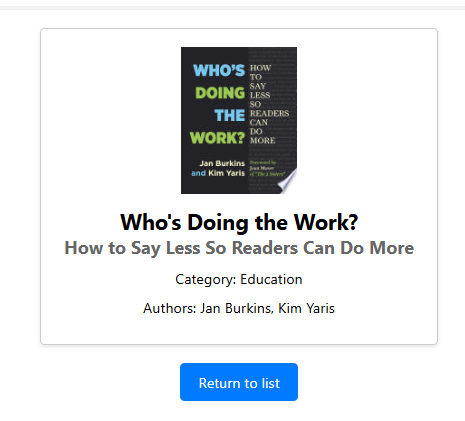

# Booksearch project

Simple and useful template example of application for searching and filtering of books, made using the Google Books service.

## How to run and clone react app

Open your terminal and then type. $ git clone {the url to the GitHub repo} This clones the repo.
cd into the new folder and type. $ npm install. This installs the required dependencies.
To run the React project. $ npm start.

You can visit book detailed page and return back.

